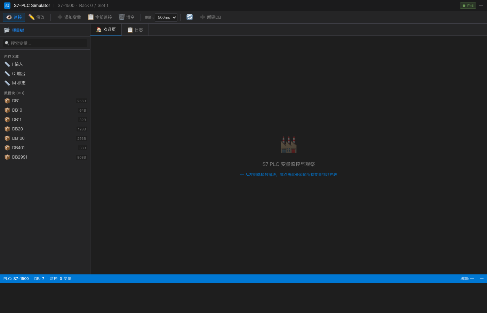

# S7 PLC Simulator

A simulated S7 PLC with Web Admin API for testing [s7-connector-rs](https://github.com/philipgreat/s7-connector-rs).

## Features

- **S7 Protocol Server** - Simulates S7-300/400/1200/1500 PLCs on port 102
- **Web Admin API** - REST API for managing memory and data blocks
- **Admin Dashboard** - Web UI for viewing and editing DB blocks
- **Shared Memory** - Both servers use the same memory state
- **JSON Configuration** - Load PLC configuration from JSON file
- **Connection Tracking** - Monitor active S7 client connections
- **Log Viewer** - Real-time log display in Web UI
- **TIA Portal Style UI** - Industrial SCADA-inspired dark theme

## Screenshots

| Dashboard | DB Viewer | Logs |
|-----------|-----------|------|
|  |  |  |

## Quick Start

```bash
# Build
cargo build --release

# Run with default configuration
cargo run

# Run with custom JSON configuration
cargo run -- --config plc_config.json

# Or use custom ports
cargo run -- --s7-port 102 --web-port 8080
```

Then open http://localhost:8080/ in your browser.

## Architecture

```
s7-plc-simulator/
├── src/
│   ├── main.rs       # Entry point, spawns both servers
│   ├── lib.rs        # S7 protocol handler
│   ├── memory.rs     # PLC memory management
│   ├── api/
│   │   └── mod.rs    # REST API handlers
│   ├── tests.rs      # Unit tests (106 tests)
│   └── static/
│       └── admin.html # Web admin dashboard
├── plc_config.json   # PLC configuration file
└── Cargo.toml
```

## Configuration

The simulator supports JSON configuration files:

```bash
cargo run -- --config plc_config.json
```

Example `plc_config.json`:
```json
{
  "plc": {
    "type": "S7-1500",
    "rack": 0,
    "slot": 1
  },
  "memory": {
    "inputs": { "size": 256 },
    "outputs": { "size": 256 },
    "flags": { "size": 1024 }
  },
  "data_blocks": [
    {
      "number": 1,
      "size": 256,
      "description": "System Data Block",
      "variables": [
        {
          "name": "system_status",
          "offset": 0,
          "type": "WORD",
          "value": 1,
          "description": "系统状态"
        }
      ]
    }
  ]
}
```

Supported variable types: `BOOL`, `BYTE`, `WORD`, `DWORD`, `INT`, `DINT`, `REAL`, `STRING`, `DT`.

## Modules

### `memory.rs` - Memory Management
- Input markers (I) - 256 bytes
- Output markers (Q) - 256 bytes  
- Flags (M) - 1024 bytes
- Data Blocks (DB) - Dynamic, configurable via JSON

### `lib.rs` - S7 Protocol Handler
- COTP connection handshake
- S7 Setup Communication
- Read/Write Variable requests
- Connection tracking
- Event logging

### `api/mod.rs` - REST API
- Web server using Axum
- All API endpoints
- Log retrieval endpoint

## Web Admin Dashboard

Access at http://localhost:8080/

Features:
- **Monitor Table** - Real-time variable monitoring with value highlighting
- **Hex Viewer** - Byte-level memory inspection
- **DB Navigation** - Tree view of all data blocks
- **Write Dialog** - Right-click to modify values
- **Log Viewer** - Real-time S7 connection and operation logs
- **Connection List** - Active S7 client connections

## REST API Endpoints

### Data Blocks
| Method | Endpoint | Description |
|--------|----------|-------------|
| GET | `/api/dbs` | List all DBs |
| GET | `/api/db/:number` | Get DB content |
| GET | `/api/db/:number/variables` | Get DB variables with values |
| POST | `/api/db` | Create new DB |
| DELETE | `/api/db/:number` | Delete DB |
| POST | `/api/db/:number/write` | Write single value |
| POST | `/api/db/:number/write-multi` | Write multiple values |
| POST | `/api/db/:number/clear` | Clear DB |

### Memory Areas
| Method | Endpoint | Description |
|--------|----------|-------------|
| GET | `/api/memory/inputs` | Get Inputs (I) |
| GET | `/api/memory/outputs` | Get Outputs (Q) |
| GET | `/api/memory/flags` | Get Flags (M) |

### Connections & Logs
| Method | Endpoint | Description |
|--------|----------|-------------|
| GET | `/api/connections` | List active S7 connections |
| GET | `/api/logs` | Get recent log entries |

### Other
| Method | Endpoint | Description |
|--------|----------|-------------|
| GET | `/` | Web Admin Dashboard |
| GET | `/health` | Health check |

## API Examples

```bash
# List all data blocks
curl http://localhost:8080/api/dbs

# Get DB1 content
curl http://localhost:8080/api/db/1

# Create new DB
curl -X POST http://localhost:8080/api/db \
  -H "Content-Type: application/json" \
  -d '{"number": 100, "size": 512}'

# Write INT value
curl -X POST http://localhost:8080/api/db/1/write \
  -H "Content-Type: application/json" \
  -d '{"offset": 0, "data_type": "int", "value": 1234}'

# Write REAL value  
curl -X POST http://localhost:8080/api/db/1/write \
  -H "Content-Type: application/json" \
  -d '{"offset": 4, "data_type": "real", "value": 3.14159}'

# Write STRING
curl -X POST http://localhost:8080/api/db/1/write \
  -H "Content-Type: application/json" \
  -d '{"offset": 8, "data_type": "string", "value": "Hello"}'

# Write HEX bytes
curl -X POST http://localhost:8080/api/db/1/write \
  -H "Content-Type: application/json" \
  -d '{"offset": 0, "data_type": "hex", "value": "DEADBEEF"}'

# Clear DB
curl -X POST http://localhost:8080/api/db/1/clear

# Delete DB
curl -X DELETE http://localhost:8080/api/db/100

# Get logs
curl http://localhost:8080/api/logs

# Get active connections
curl http://localhost:8080/api/connections
```

## Testing with s7-connector-rs

Start the simulator:
```bash
cargo run -- --config plc_config.json
```

In another terminal, test connection:
```bash
cd ../s7-connector-rs
cargo run --example basic_connect
```

## Unit Tests

Run the test suite:
```bash
cargo test
```

106 tests covering:
- Memory area operations
- PLC memory read/write
- Typed data access (byte, word, dword, int, real, string)
- Data block management
- S7 protocol parsing
- Connection tracking
- JSON configuration loading

## Pre-loaded Data Blocks (Default)

| DB | Size | Content |
|----|------|---------|
| DB1 | 256 bytes | System data |
| DB10 | 64 bytes | Real values: [1.5, 2.5, 3.14, 100.0] |
| DB11 | 32 bytes | Integer values: [100, -200, 300, -400] |
| DB20 | 128 bytes | String: "Hello World!" |
| DB100 | 256 bytes | Filling station data |
| DB401 | 38 bytes | Filling station status |
| DB2991 | 808 bytes | Report data |

## License

MIT
